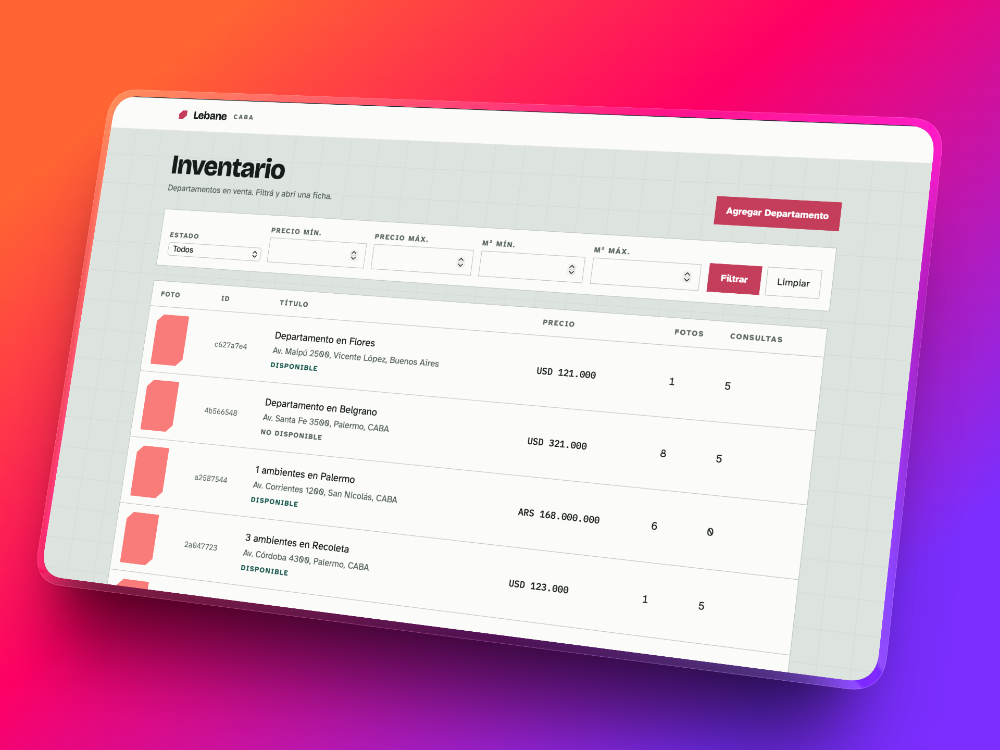

# spec-first-panel

Este repo explora cómo construir una app fullstack — API en Python (FastAPI) y panel en React — dejando las decisiones en especificaciones y usando el agente de Cursor para implementar contra esas specs, no al revés.

El dominio (un panel de administración de departamentos en venta) es solo el caso. El punto es el método: spec-driven design mínimo, sin un framework encima de Cursor.



**Demo:** [Railway](https://frontend-production-c4a83.up.railway.app) — `admin@lebane.local` / `lebanelebane`

## Spec-driven, en este repo

Tres capas de documento, cada una con un contrato. Si algo no entra en esa capa, no va ahí.

1. **Producto** — para quién es, qué se considera hecho, qué queda fuera.
2. **Arquitectura** — stack, capas, contrato HTTP, persistencia. Si cambia el código, primero cambia este archivo.
3. **Features** — un recorte implementable. No está hecha porque compile: hay que tildar checkpoints y que “How to test” pase.

El orden de trabajo es **una feature a la vez**, backend + frontend en el mismo incremento cuando la feature lo pide. Si una idea choca con `product.md`, gana la spec.

```text
backend/   # Python, uv, FastAPI
frontend/  # Vite, React, TypeScript
specs/     # producto, arquitectura y features
```

Cada feature en `specs/features/` tiene `status` (`created` → `in_progress` → `done`), Goal, In/Out, checkpoints, How to test y Review. `done` solo si los checkpoints están cerrados y el comando de prueba funciona.

## Specs

### `specs/product.md`

Intención del producto: usuarios, alcance, reglas, contrato HTTP, backlog. No describe el detalle de implementación de cada pantalla.

### `specs/architecture.md`

Decisiones técnicas estables: capas del backend, organización del frontend, stack, tests, convenciones. Si el código necesita otra forma, primero se actualiza este archivo.

### Features (`specs/features/`)

Las features se numeran y se apuntan entre sí. Se implementan de a una.

| Archivo | Qué cubre |
|---|---|
| [`01-infrastructure.md`](specs/features/01-infrastructure.md) | Compose local: API, Postgres, MinIO, esqueletos de backend y frontend |
| [`02-departments-api.md`](specs/features/02-departments-api.md) | CRUD de departamentos, filtros, paginación, DDD en capas |
| [`03-images.md`](specs/features/03-images.md) | Fotos en MinIO/S3, máximo 5 en el alta, miniatura y totales en el listado |
| [`04-inquiries.md`](specs/features/04-inquiries.md) | Consultas de interesados en el agregado: detalle y conteo en el listado |
| [`05-address.md`](specs/features/05-address.md) | Autocompletado de dirección con Nominatim; persiste texto + coordenadas |
| [`06-seed.md`](specs/features/06-seed.md) | Semilla de ≥ 500 departamentos, fotos y consultas |
| [`07-panel-list.md`](specs/features/07-panel-list.md) | Tabla paginada, filtros, estados de carga / vacío / error |
| [`08-panel-create.md`](specs/features/08-panel-create.md) | Formulario de alta, tope de 5 fotos, dirección autocompletada |
| [`09-panel-detail.md`](specs/features/09-panel-detail.md) | Ficha en ruta propia, galería, edición in-place |
| [`10-quality.md`](specs/features/10-quality.md) | Tests, README de entrega, listón de calidad |
| [`11-create-inquiry.md`](specs/features/11-create-inquiry.md) | Registrar una consulta desde el panel (`POST` anidado) |
| [`12-auth.md`](specs/features/12-auth.md) | Sesión JWT, admin único y agentes, rutas protegidas |
| [`13-create-agent.md`](specs/features/13-create-agent.md) | El admin lista operadores y crea agentes desde el panel |
| [`14-panel-polish.md`](specs/features/14-panel-polish.md) | Pulido pendiente: filtros más claros, búsqueda, mapa en la ficha (`created`) |

## Cursor rule

[`.cursor/rules/spec-driven.mdc`](.cursor/rules/spec-driven.mdc) está marcada con `alwaysApply: true`. No genera specs: obliga a leerlas en un orden fijo antes de codear.

1. Leer `specs/product.md`
2. Leer `specs/architecture.md`
3. Trabajar **una** feature de `specs/features/`
4. Pasarla a `in_progress` y actualizar la tabla en `product.md`
5. Implementar contra la arquitectura (backend en capas, frontend por `features/`, tests junto al código)
6. Tildar checkpoints en el mismo cambio; anotar decisiones estables en Review
7. `done` solo si los checkpoints cierran y “How to test” pasa
8. Un commit Conventional Commit por cambio coherente; no mezclar dos features

Si el pedido choca con una decisión de `product.md`, se sigue la spec y se dice.

## Arranque

```bash
cp .env.example .env
docker compose up --build
```

Si Postgres quedó de una cadena Alembic vieja: `docker compose down -v && docker compose up --build`.

| Servicio | URL |
|---|---|
| API | http://localhost:8000 |
| OpenAPI | http://localhost:8000/docs |
| Health | http://localhost:8000/health |
| Postgres | localhost:5432 |
| MinIO | http://localhost:9000 · consola :9001 |

Panel:

```bash
cp frontend/.env.example frontend/.env
cd frontend && npm install && npm run dev
```

http://localhost:5173 → API en `:8000`. Sin sesión abre `/ingresar`.

Seed (≥ 500 departamentos). No corre al arrancar:

```bash
docker compose exec api python -m app.seed
docker compose exec api python -m app.seed --force   # borra y vuelve a sembrar
```

### Tests

```bash
cd backend && uv sync --group dev && uv run pytest
cd backend && uv run ruff check .
cd frontend && npm test
```

El detalle de stack, capas y contrato HTTP vive en [`specs/architecture.md`](specs/architecture.md), no en este README.
